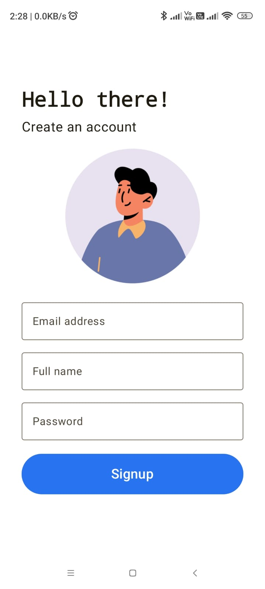
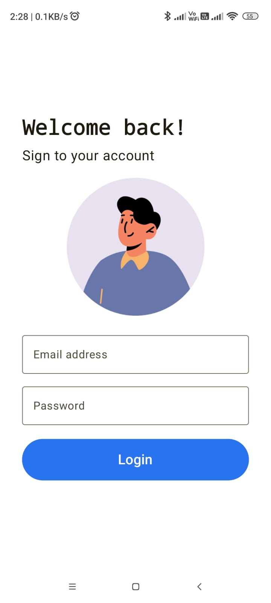
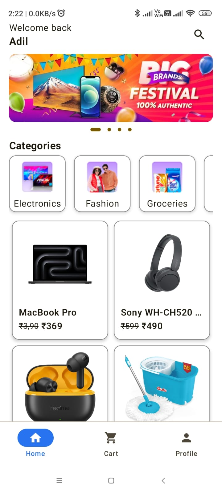
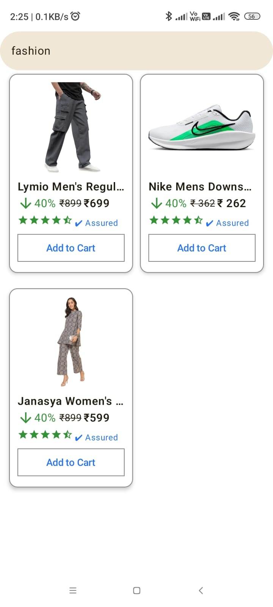
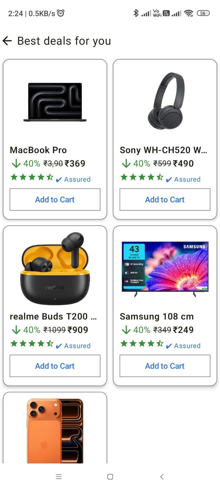
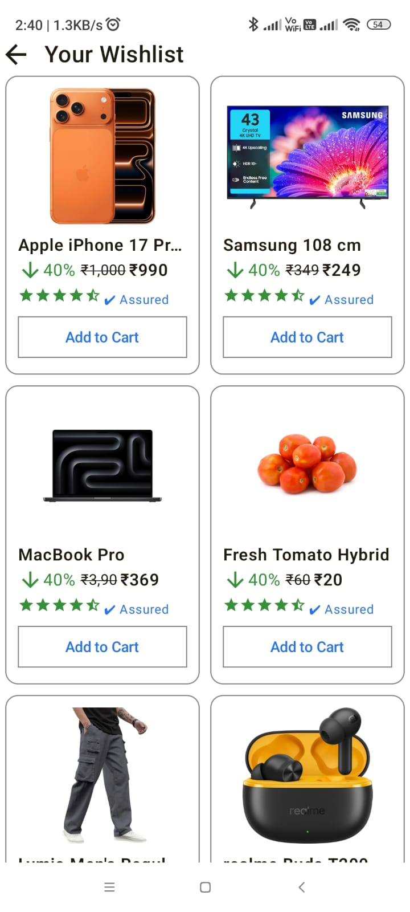
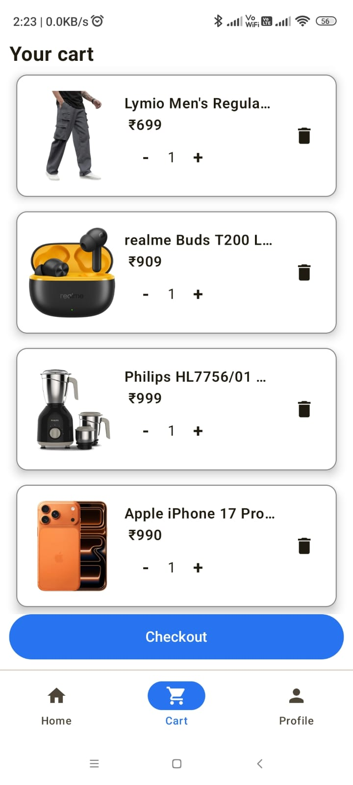
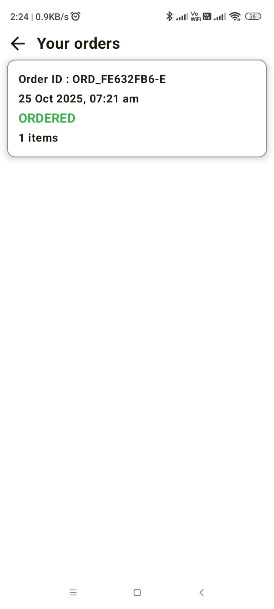

# 🛍️ Elira - Shopping Application

Elira is a modern shopping application built using **Jetpack Compose** and **Firebase**, designed to deliver a seamless shopping experience.  
Users can browse products, manage carts and wishlists, complete secure payments, and more — all with a clean and responsive UI supporting both **light** and **dark** themes.

---

## 🚀 Features

### 🔐 Authentication
- Sign up with **Email & Password**
- Login and Logout
- **Firebase Authentication** integration
- Update profile details: name, email, and address

---

### 🛒 Shopping & Products
- Browse products **by category**
- View **category-wise product listings**
- **Search** items by category
- Detailed **product information** page

---

### 💖 Wishlist & Cart
- Add or remove products from **Wishlist**
- View all saved wishlist items
- Add to **Cart**, increment/decrement quantity, or remove items
- Real-time cart updates using **Firebase Firestore**

---

### 💳 Checkout & Payments
- Integrated with **Razorpay** for secure payments
- Complete the checkout process smoothly
- View **order history** (all previous orders stored in Firestore)

---

### ⚙️ Additional Features
- **Dark & Light Theme** support
- User-friendly UI built with **Jetpack Compose**
- Real-time data updates with **Firebase Firestore**
- Optimized state management using **ViewModel**
- Well-structured MVVM architecture

---

## 🏗️ Tech Stack

| Category | Technology |
|-----------|-------------|
| **Frontend** | Jetpack Compose (Kotlin) |
| **Architecture** | MVVM (Model-View-ViewModel) |
| **Backend** | Firebase Firestore |
| **Authentication** | Firebase Auth |
| **Payment Gateway** | Razorpay |
| **Language** | Kotlin |
| **Design** | Material 3, Compose UI, Dynamic Theme |

---

## 🖼️ Screenshots

> Replace the image paths with your actual screenshot filenames (e.g., `screenshots/signup.png`)

|              Signup               |              Login              |             Home              | Search |
|:---------------------------------:|:-------------------------------:|:-----------------------------:|:--:|
|  |  |  |  |

| Category | Wishlist | Cart | Checkout |
|:--:|:--:|:--:|:--:|
|  |  |  |  |

| Orders | Edit Profile | Profile |  |
|:--:|:--:|:--:|:--:|
|  |  |  |  |

---

⭐ If you like this project, don’t forget to star the repo!

---